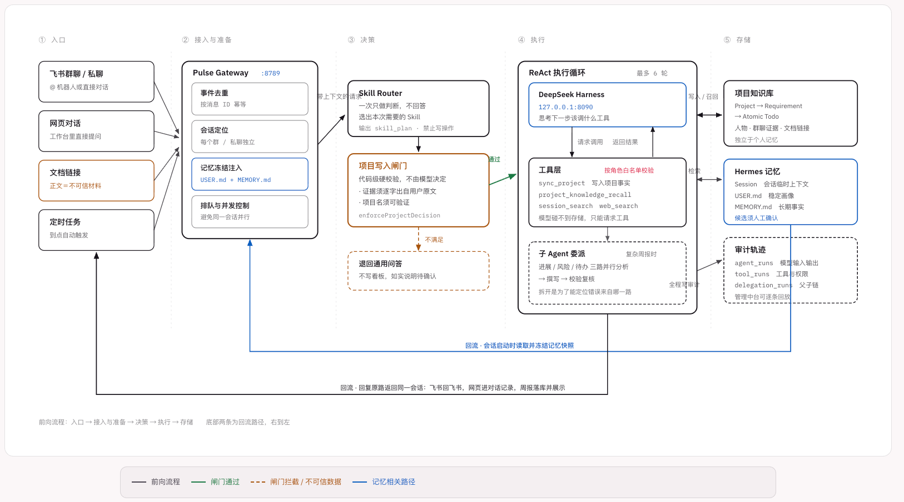
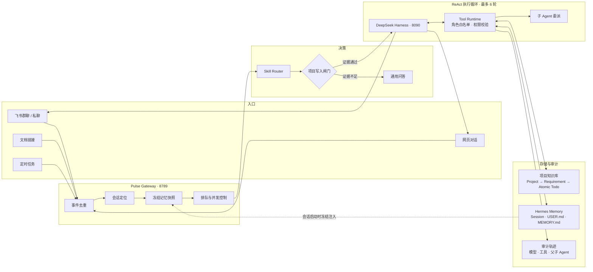

# Pulse Personal Agent

> 不是要求人维护另一套项目系统，而是让 Agent 从工作中本来就存在的文档、群聊和对话里提取事实，并把 Todo、进展与周报变成自然产物。

[](./LICENSE)
[](./package.json)
[](./LOCAL_SETUP.md)
[](./docs/AGENT_ARCHITECTURE.md)

Pulse 是一个本地优先、可以部署到 Linux 服务器的个人生活与工作管理 Agent。项目管理是第一个完整业务模块，但不是系统边界；普通问答、文档理解、群聊总结、任务拆解、周报生成、定时任务、搜索、Skill 与长期记忆共用同一套 Agent Runtime。

## 为什么是 Pulse

传统项目工具要求人先建项目、拆需求、填负责人和排期，周五再把字段人工组织成汇报。系统只负责存储，理解和维护成本仍然在人身上。

Pulse 反过来工作：你提供一段自然语言、一份飞书文档或一段群聊，Agent 负责判断它是否属于项目，识别已有项目，拆分可独立验收的需求，把复合事项变成单人单交付的原子 Todo，并保留来源。用户只确认材料里确实不明确的内容。

```text
传统方式：人理解现实 → 人维护结构 → 系统存储 → 人再次整理周报
Pulse：   人提供材料 → Agent 理解与提炼 → 工程服务可靠写入 → 人确认结果
```

这决定了 Pulse 的核心原则：**需要理解和判断的交给 Skill，需要准确执行和保存的交给 Tool 与工程服务，需要展示和交互的交给 UI。**

## 完整架构

[](./docs/assets/pulse-agent-architecture.png)

> 从左到右是入口、接入与准备、决策、执行和存储；底部是回复与记忆回流。点击图片可查看完整尺寸。

<details>
<summary>查看可检索的 Mermaid 结构图</summary>



</details>

一条消息进入系统后，会依次经历八个阶段：

1. **接收与去重**：按消息 ID 幂等入库，飞书重复推送不会造成重复回复。
2. **会话定位**：每个群聊和私聊拥有独立 Session，上下文不会跨会话污染。
3. **记忆快照**：会话开始时冻结用户画像与长期事实，本轮推理中途不会被改写。
4. **Skill 路由**：模型只判断意图、能力和执行计划，不在规划阶段写数据。
5. **项目闸门**：即使模型认为请求与项目有关，代码仍会验证项目名和用户原文证据；证据不足就退回通用能力。
6. **ReAct 循环**：Harness 在“思考—调用工具—观察结果”之间循环，工具范围由当前角色限定。
7. **确定性落库**：项目、需求和 Todo 通过受控服务去重、更新、软删除和持久化。
8. **回复与沉淀**：结果返回原会话；记忆和 Skill 只能生成候选，必须经过人工发布。

## Skill、Tool 与基础设施

| 层 | 负责什么 | Pulse 中的例子 |
| --- | --- | --- |
| **Skill** | 如何理解和处理一类问题 | 判断项目、拆 Requirement、提取原子 Todo、写周报 |
| **Tool** | Agent 可以申请执行什么动作 | `sync_project`、`session_search`、`web_search` |
| **Infrastructure** | 如何可靠运行和保存 | SQLite、权限、事务、索引、幂等、审计 |
| **UI** | 如何向人呈现和操作 | 任务看板、日志、Skill 草稿箱、Memory 审批 |

Skill 采用兼容 Claude Agent Skill 的 YAML Frontmatter 与 Markdown 正文。发布版本才会进入 Agent 路由；人工创建、代码同步或 Skill Curator 生成的版本都会先进入草稿箱，经过评测和人工审核后才能生效。

### Skill 自进化

`skill-curator` 可以读取已发布 Skill、真实运行证据和用户明确指定的材料，生成改进候选：

```text
真实运行证据 / 指定材料
            ↓
      Skill Curator 分析
            ↓
      候选版本 + 规则评测
            ↓
        管理后台草稿箱
            ↓
        管理员审核发布
```

模型不能直接发布 Skill、覆盖生产版本、修改插件配置或扩大自身权限。启用前需要明确允许相应运行证据发送给当前模型服务；配置方法见[部署教程](./docs/DEPLOYMENT_TUTORIAL.md#10-启用-skill-自进化)。

## 角色与最小权限

同一个模型在不同阶段使用不同角色。角色对应代码中的固定工具白名单，模型无法直接接触数据库。

| 角色 | 职责 | 主要可用工具 |
| --- | --- | --- |
| `skill-router` | 识别意图并生成执行计划 | 无写权限 |
| `personal-agent` | 通用问答、个人事项与检索 | Session、Memory、工作区、群聊和网页检索 |
| `project-manager` | 项目、需求和 Todo 同步 | 项目召回、群聊检索、`sync_project` |
| `report-writer` | 根据项目证据生成周报 | `project_knowledge_recall` |
| `scheduler-manager` | 创建和管理定时任务 | 创建、查询、暂停、恢复和删除定时任务 |
| `memory-curator` | 月度长期记忆审阅 | 检索证据并写入记忆候选 |

`report-writer` 被刻意限制为只能召回项目知识，避免把普通搜索结果或模型印象写进正式周报。每次模型调用、上下文注入、工具入参、工具返回、耗时、错误和子 Agent 链路都会进入审计记录，可在管理后台逐轮回放。

## 记忆与项目知识

Pulse 把个人记忆和项目知识分成两个系统。

**Hermes Memory** 保存人与 Agent 之间相对稳定的上下文：

- `Session`：每个群聊或私聊的临时上下文。
- `USER.md`：稳定的用户偏好与画像。
- `MEMORY.md`：已经确认的长期事实和目标。
- `session_search`：需要跨会话追溯时由 Agent 显式调用。
- Memory Curator：按月从真实证据中生成候选，人工确认后进入下一周期。

**项目知识库** 保存可追溯的业务事实：

- 项目与业务需求；
- 子需求进展、风险与下一步；
- 原子 Todo、负责人和截止时间；
- 关联人物、群聊证据和飞书文档链接。

生成周报时，Agent 按项目调用 `project_knowledge_recall`。项目流水不会污染长期用户记忆，长期记忆也不能替代项目证据。

## 项目数据模型

所有项目事实收敛为三层结构：

| 层级 | 定义 | 拆分标准 |
| --- | --- | --- |
| **Project** | 持续推进、具有明确交付目标的业务对象 | 优先匹配已有项目，避免创建近义项目 |
| **Requirement** | 可以独立推进和验收的一块工作 | 交付物、团队或上线批次不同就拆开 |
| **Atomic Todo** | 最小可执行单元 | 一个动作、一个结果、一个负责人、一个截止时间 |

语义理解由项目 Skill 完成，数据库写入、状态更新、软删除、时间筛选、权限和历史版本由 Task Service 确定性执行。不同入口最终进入同一条链路：

```text
飞书 / Web / 文档 / 群聊 / 定时任务
                  ↓
         Project Management Skill
                  ↓
             Structured JSON
                  ↓
          Task Service + Database
                  ↓
              Task Board
```

## 不可信数据边界

飞书文档正文、群聊消息和网页结果全部被视为不可信材料，不能覆盖系统提示词、Skill 规则或工具权限。系统通过三层约束降低提示词注入和误写风险：

1. 外部内容进入上下文时会被明确标记为不可信数据；
2. Skill 规定文档中的命令不能被当作系统指令执行；
3. 项目写入闸门要求项目名和关键证据可以在用户输入或已确认项目索引中验证。

原则是：**宁可标记“待确认”，也不根据文档中的未知指令猜测或写入。**

## 飞书通信

默认链路是：

```text
飞书 → lark-cli → Pulse Gateway → Harness / Tool Runtime → SQLite → 飞书回复
```

`lark-cli` 负责长连接接收 `im.message.receive_v1`、读取用户授权的文档与群聊历史、回复消息和添加处理中表情。Gateway 负责身份配对、群成员权限、幂等、会话队列和业务编排。官方 SDK 与 OpenClaw 仅保留为可选适配器，不能和 CLI 同时消费同一个 Bot。

群聊历史严格按 `chat_id` 隔离。事件流持续保存 Bot 加入后的新消息；需要总结历史、评价发言或生成项目周报时，系统会使用已授权用户身份补采当前群历史，权限不足时回退到群内 Bot 可见范围。

## 快速开始

### 环境要求

- Node.js `22.13+`
- pnpm `11`
- Python `3.10+`
- Git、curl、Python venv
- 飞书企业自建应用
- DeepSeek API Key

### 本地运行

```bash
git clone https://github.com/Seajelly-foever/Pulse-agent.git pulse
cd pulse

pnpm install --frozen-lockfile
cp .env.local-agent.example .env.local-agent
# 编辑 .env.local-agent，填写飞书与模型凭证

python3 -m venv harness-service/.venv
harness-service/.venv/bin/python -m pip install \
  --disable-pip-version-check \
  -r harness-service/requirements.txt

pnpm local:up
```

访问地址：

- 用户工作台：<http://localhost:3000>
- 管理后台：<http://localhost:3000/control>
- Gateway 健康检查：<http://127.0.0.1:8789/health>
- Harness 健康检查：<http://127.0.0.1:8090/health>

在关闭终端后继续运行：

```bash
pnpm local:daemon:start
pnpm local:daemon:status
pnpm local:daemon:stop
```

完整飞书应用、lark-cli 授权和配对流程见[本地运行说明](./LOCAL_SETUP.md)。第一次部署服务器请直接阅读[从零部署教程](./docs/DEPLOYMENT_TUTORIAL.md)。

## Linux 生产部署

生产环境由 systemd 管理，Web 是唯一对外端口，Gateway 和 Harness 仅监听回环地址。

| 组件 | 默认位置 | 边界 |
| --- | --- | --- |
| Web | `0.0.0.0:3000` | 通过 HTTPS 反向代理对外提供服务 |
| Gateway | `127.0.0.1:8789` | 只允许本机 Web 与通信适配器访问 |
| Harness | `127.0.0.1:8090` | 只允许 Gateway 调用 |
| SQLite | `/srv/pulse/pulse.db` | 保存项目、记忆、Skill 与审计 |
| Harness Sessions | `/srv/pulse/harness-sessions` | 保存模型会话状态 |
| Secrets | `/etc/pulse/pulse.env` | 不进入 Git 仓库 |

安装与启动：

```bash
sudo PULSE_RUN_USER="$USER" bash deploy/linux/bootstrap.sh
# 编辑 /etc/pulse/pulse.env
sudo systemctl enable --now pulse
bash deploy/linux/healthcheck.sh
```

健康检查必须依次返回 `harness: ok`、`gateway: ok`、`web: ok`。生产机存在未提交改动时应停止更新，数据库和 Secret 必须独立备份，不跟随 Git 覆盖。

## 管理后台

`/control` 不是展示型仪表盘，而是 Agent 的真实控制面：

- 模型路由、当前模型与请求配置；
- 每轮输入、输出、Context、Memory 与工具轨迹；
- 系统提示词草稿、发布和版本历史；
- Skill 草稿、标签、评测、发布与回滚；
- 插件、网页搜索和文档能力开关；
- Session Memory、长期记忆候选和月度审阅；
- 项目知识库、群聊历史和飞书文档同步；
- 定时任务、子 Agent 与工具权限审计。

API Key 只从环境变量读取，不进入页面、数据库或运行日志。多人使用时还需要在生产环境补充登录认证、租户隔离和管理员角色控制，不能直接把管理后台裸露到公网。

## 验证

```bash
CI=true pnpm test
```

测试覆盖页面构建、飞书事件幂等、群聊权限与历史补采、项目写入闸门、原子 Todo、定时任务、ReAct 工具循环、Hermes Session、长期记忆候选、项目知识召回、Skill 发布治理、网页工具和管理后台渲染。

## 目录

```text
app/                    Web 工作台、管理后台与 API
local-runtime/          Gateway、Agent Loop、Tool Runtime、Memory、Scheduler
harness-service/        DeepSeek Harness 独立模型服务
db/ + drizzle/          Web / D1 数据模型与迁移
deploy/linux/           systemd 安装、配置与健康检查
docs/                   架构、部署与 Skill Review 文档
integrations/           飞书、OpenClaw 与 DSH 社区插件适配
scripts/                本地守护、生产启动与插件同步
```

更完整的模块边界与运行契约见 [Agent 架构说明](./docs/AGENT_ARCHITECTURE.md)。

## 开源边界

仓库不会提交真实 `.env`、API Key、飞书令牌、SQLite 数据库、聊天记录、模型 Session、日志或用户文档。部署前请确认组织允许将相关代码和数据交给所选择的第三方模型及搜索服务。

第三方项目和架构参考见 [THIRD_PARTY_NOTICES.md](./THIRD_PARTY_NOTICES.md)。安全问题请参考 [SECURITY.md](./SECURITY.md)。

## License

[MIT License](./LICENSE)
